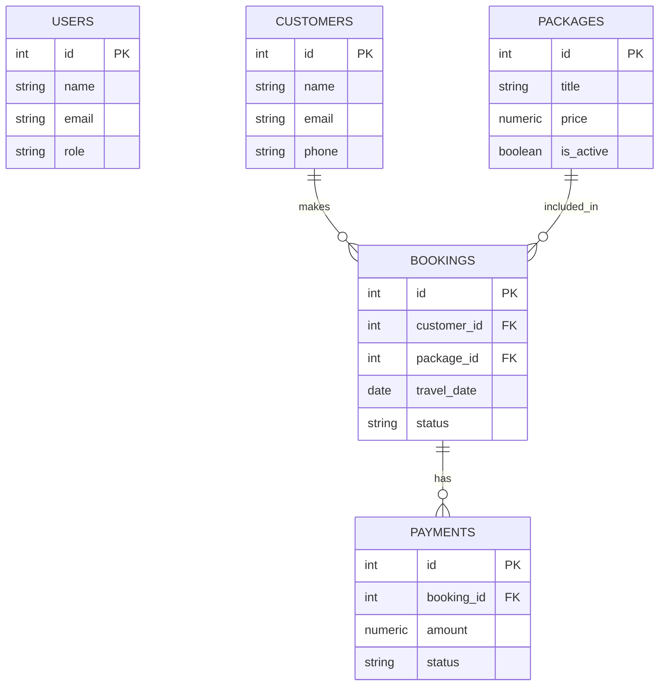

# Karimunjawa Travel Admin Dashboard - Database

Dokumentasi ini berisi panduan lengkap mengenai struktur, instalasi, dan pengelolaan database untuk aplikasi **Dashboard Admin Travel Karimunjawa**.

## 🏗️ Struktur File
- `schema.sql` → Berisi struktur tabel (DDL) database.
- `seed.sql` → Berisi data awal / *dummy data* untuk keperluan testing.

## 🗂️ Tabel Utama
Aplikasi ini menggunakan 5 tabel utama yang saling berelasi:
1. **`users`** - Data admin/pengguna sistem.
2. **`customers`** - Data profil pelanggan.
3. **`packages`** - Daftar paket wisata Karimunjawa.
4. **`bookings`** - Transaksi pemesanan wisata.
5. **`payments`** - Riwayat pembayaran booking.

---

## 🚀 Cara Import Database

Pastikan Anda berada di direktori `backend/` sebelum menjalankan perintah di bawah ini.

### STEP 1: Import Schema
Gunakan perintah ini untuk membuat struktur tabel:
```bash
psql -U karimunjawa_user -d karimunjawa_db -h localhost -f database/schema.sql
```
*Jika diminta password, masukkan:* `password123`

### STEP 2: Import Seed Data
Gunakan perintah ini untuk mengisi database dengan data contoh:
```bash
psql -U karimunjawa_user -d karimunjawa_db -h localhost -f database/seed.sql
```

---

## 🔍 Cek Isi Database

Untuk memastikan data sudah masuk, Anda bisa masuk ke terminal PostgreSQL:

```bash
psql -U karimunjawa_user -d karimunjawa_db -h localhost
```

### Perintah Penting di dalam PSQL:
- **Lihat daftar tabel:** `\dt`
- **Lihat isi tabel customers:** `SELECT * FROM customers;`
- **Lihat isi paket wisata:** `SELECT * FROM packages;`
- **Lihat isi pemesanan:** `SELECT * FROM bookings;`

---

## 📊 Query JOIN (Power of Database)

Query ini sangat penting untuk menampilkan data di frontend dashboard. Ini menggabungkan data booking, nama pelanggan, dan nama paket wisata.

```sql
SELECT
    b.id,
    c.name AS customer_name,
    p.title AS package_name,
    b.travel_date,
    b.guests,
    b.total_price,
    b.status,
    b.payment_status
FROM bookings b
JOIN customers c ON b.customer_id = c.id
JOIN packages p ON b.package_id = p.id
ORDER BY b.id DESC;
```

**Kenapa query ini penting?**
Karena di halaman **Bookings** pada dashboard, kita membutuhkan tampilan tabel seperti:
`Booking ID | Customer | Package | Travel Date | Guests | Total | Status`

---

## 🔗 Struktur Relasi & Manfaat

### Diagram Relasi (ERD)


### Mengapa struktur ini bagus?
Struktur ini sudah dioptimalkan untuk fitur-fitur Dashboard:
1. **Dashboard Overview:** Menghitung total booking, revenue, total customer, dan paket aktif.
2. **Bookings Page:** List booking lengkap dengan detail status dan pembayaran.
3. **Customers Page:** Riwayat perjalanan per pelanggan.
4. **Packages Page:** Manajemen harga dan status aktivasi paket wisata.

---

## 📝 Detail Schema (Dokumentasi Kolom)

| Tabel | Deskripsi |
| :--- | :--- |
| `users` | Autentikasi Admin (ID, Name, Email, Password, Role) |
| `customers` | Profil Pelanggan (ID, Name, Email, Phone, Address) |
| `packages` | Katalog Wisata (ID, Title, Price, Duration, Destination, Image, Is_active) |
| `bookings` | Core Transaksi (ID, Customer_ID, Package_ID, Date, Guests, Total, Status) |
| `payments` | Keuangan (ID, Booking_ID, Amount, Method, Status, Paid_At) |
